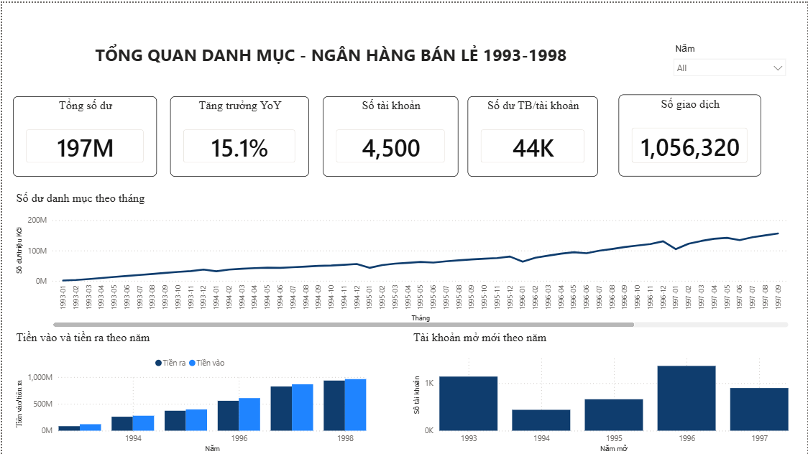
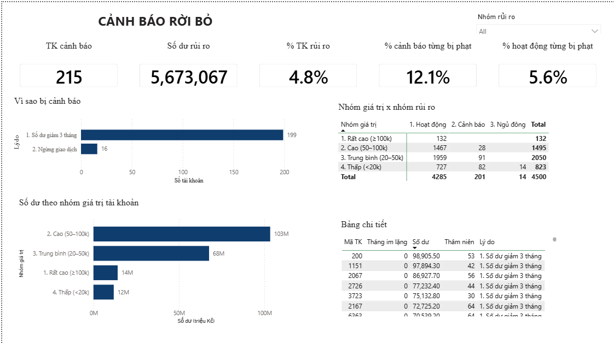

# Phân tích danh mục khách hàng ngân hàng bán lẻ — Czech Bank (1993–1998)

**Câu hỏi trung tâm:**

> Ngân hàng đang **kiếm tiền từ ai**, và **sắp mất ai**?

| | |
|---|---|
| Vai trò mô phỏng | Data Analyst — khối Khách hàng cá nhân |
| Công cụ | SQL (DuckDB) · Power BI · Python (profiling) |
| Quy mô dữ liệu | **1.056.320 giao dịch** · 4.500 tài khoản · 6 năm liên tục |
| Sản phẩm | Dashboard Power BI 2 trang + pipeline dữ liệu 3 tầng + notebook profiling |

---

## Kết quả chính

**1. Danh mục tăng trưởng liên tục suốt 6 năm.**
Số giao dịch tăng từ 28.205 (1993) lên 322.277 (1998) — gấp **11,4 lần**. Tổng số dư cuối kỳ đạt **197,1 triệu Kč**, tăng **15,1%** so với năm trước. Dòng tiền vào vượt dòng tiền ra ở **cả sáu năm**.

**2. Rủi ro rời bỏ tồn tại, nhưng không nằm ở nơi ngân hàng sợ nhất.**
215 tài khoản (4,8%) có dấu hiệu rời bỏ — nghe đáng lo. Nhưng chúng chỉ nắm **5,67 triệu Kč, tức 2,9% danh mục**. Lý do: **toàn bộ 132 tài khoản giá trị cao nhất (≥100k Kč) đều hoạt động bình thường, không một trường hợp cảnh báo nào.** 45% số tài khoản rủi ro rơi vào nhóm số dư thấp nhất (<20k).

**3. 92,5% nhóm cảnh báo vẫn đang giao dịch — họ chưa đi, họ đang chuyển tiền đi.**
Trong 215 tài khoản cảnh báo, chỉ **16** thật sự ngừng giao dịch. **199** tài khoản còn lại vẫn phát sinh giao dịch đều đặn, bị gắn cờ vì số dư giảm ba tháng liên tiếp. Đây là hai tình huống khách hàng khác hẳn nhau và đòi hỏi hai cách xử lý khác nhau.

**4. Tiền gửi tập trung mạnh.**
1.627 tài khoản (36% số lượng) nắm giữ **117,6 triệu Kč — 59,7% tổng tiền gửi**.

**5. Tháng 1 là tháng duy nhất trong năm có dòng tiền ròng âm.**
Trung bình **−15,3 triệu Kč**, trong khi tháng 2 là **+11,2 triệu**. Nguyên nhân không phải khách rút tiền hàng loạt: tiền vào tháng 1 vẫn bình thường, nhưng **tiền ra tăng 31% và số giao dịch tăng 54%** — dấu hiệu của rất nhiều khoản chi nhỏ cùng đến hạn (bảo hiểm, hoá đơn sinh hoạt qua hệ thống SIPO), không phải vài khoản rút lớn.

Giá trị nghiệp vụ: ngân hàng biết trước tháng 1 sẽ hụt thanh khoản thì chuẩn bị được nguồn.

**6. Lịch sử bị phạt lãi dự báo rủi ro rời bỏ tốt hơn thâm niên.**

| Nhóm | Tỷ lệ từng bị phạt lãi | Thâm niên trung bình |
|---|---:|---:|
| Hoạt động bình thường | 5,6% | 40,2 tháng |
| **Có dấu hiệu rời bỏ** | **12,1%** | 40,6 tháng |

Tỷ lệ bị phạt **gấp 2,2 lần**, trong khi thâm niên gần như không khác biệt. Nghĩa là "khách gắn bó lâu thì ít rời đi" — giả định thường gặp — **không đúng với danh mục này**. Tín hiệu đáng theo dõi là **hành vi tài chính**, không phải thời gian gắn bó.

---

## Khuyến nghị

**Không chăm sóc dàn trải cả 215 tài khoản cảnh báo.** Bốn phương án và cái giá của từng phương án:

| Phương án | Số tài khoản phải chăm sóc | Tiền bảo vệ được (Kč) | Hiệu quả mỗi tài khoản |
|---|---:|---:|---:|
| Chăm sóc toàn bộ | 215 | 5.673.067 | 26.386 |
| Chỉ nhóm Cao (50–100k) | 28 | 1.798.724 | **64.240** |
| **Nhóm Cao + Trung bình** | **119** | **4.582.974** | **38.512** |
| Chỉ nhóm Thấp (<20k) | 96 | 1.090.093 | 11.355 |

**Đề xuất: tập trung vào 119 tài khoản thuộc hai nhóm giá trị cao nhất.**
Chiếm 55% khối lượng công việc nhưng bảo vệ được **81% số tiền đang rủi ro**.

**Bỏ hẳn 96 tài khoản nhóm dưới 20k.**
Chúng chiếm 45% khối lượng nhưng chỉ nắm 19% số tiền. Mỗi tài khoản trung bình 11.355 Kč — bằng một phần sáu nhóm cao. Nếu chi phí chăm sóc một khách vượt 11 nghìn Kč thì việc liên hệ nhóm này **lỗ**.

**Ưu tiên 199 tài khoản "số dư giảm nhưng vẫn giao dịch" trước 16 tài khoản đã im lặng.**
Nhóm thứ nhất vẫn còn tương tác với ngân hàng nên còn liên lạc được và chi phí giữ chân thấp. Nhóm thứ hai đã ngừng giao dịch từ 6 tháng trở lên, chi phí kéo về cao hơn nhiều.

**Thiết lập cảnh báo tự động theo hai tiêu chí riêng biệt**, không gộp thành một con số. Gộp 215 tài khoản vào một chỉ số duy nhất khiến người đọc tưởng toàn bộ sắp mất, trong khi thực tế 92,5% vẫn ở lại.

---

## Dashboard






| Trang | Trả lời câu hỏi |
|---|---|
| **Tổng quan danh mục** | Danh mục đang lớn lên hay co lại? Tiền vào ra thế nào? |
| **Cảnh báo rời bỏ** | Ai đang rút lui, vì lý do gì, và mang theo bao nhiêu tiền? |

---

## Dữ liệu

| | |
|---|---|
| Nguồn gốc | [PKDD'99 Discovery Challenge](https://sorry.vse.cz/~berka/challenge/PAST/) — Petr Berka |
| Bản tải | [The Berka Dataset — Kaggle](https://www.kaggle.com/datasets/marceloventura/the-berka-dataset) |
| Bản chất | Dữ liệu **thật**, đã ẩn danh, của một ngân hàng Séc |
| Phạm vi | 01/01/1993 – 31/12/1998 (6 năm, 2.191 ngày) |

### Tám bảng gốc

| Bảng | Số dòng | Nội dung |
|---|---:|---|
| `trans` | 1.056.320 | Giao dịch — bảng fact chính |
| `order` | 6.471 | Lệnh chuyển tiền định kỳ |
| `client` | 5.369 | Khách hàng |
| `disp` | 5.369 | Quan hệ khách hàng ↔ tài khoản |
| `account` | 4.500 | Tài khoản |
| `card` | 892 | Thẻ |
| `loan` | 682 | Khoản vay |
| `district` | 77 | Quận, kèm chỉ số kinh tế xã hội |

**Bộ dữ liệu được phát hành không kèm tài liệu mô tả cột.** Toàn bộ ý nghĩa các cột được suy ra từ phân tích phân bố, sau đó đối chiếu với tài liệu gốc PKDD'99. Xem [notebooks/01_profiling.ipynb](notebooks/01_profiling.ipynb).

---

## Kiến trúc

Pipeline ba tầng, mỗi tầng một nhiệm vụ:

```
data/bronze/     CSV thô, giữ nguyên bản gốc
     ↓  sql/01_silver.sql
data/silver/     Sửa cho đúng: kiểu dữ liệu, mã tiếng Séc, giá trị lỗi
     ↓  sql/02_gold.sql
data/gold/       Star schema cho Power BI
     ↓
dashboard/berka_analytics.pbix
```

### Mô hình sao

```
                     dim_date (2.191)
                           |
   dim_client ─── fact_transaction ─── dim_account
    (4.500)         (1.056.320)          (4.500)
                           |                 |
                     dim_district    fact_account_monthly
                        (77)              (185.615)
```

**Sáu quan hệ, tất cả đều một bậc từ dimension xuống fact.** Không có quan hệ dim–dim (snowflake), không có quan hệ giữa hai bảng fact.

| Bảng gold | Số dòng | Vai trò |
|---|---:|---|
| `fact_transaction` | 1.056.320 | 1 dòng = 1 giao dịch |
| `fact_account_monthly` | 185.615 | 1 dòng = 1 tài khoản × 1 tháng |
| `dim_account` | 4.500 | Tài khoản + phân loại rủi ro rời bỏ |
| `dim_client` | 4.500 | Khách hàng + giới tính, nhóm tuổi |
| `dim_date` | 2.191 | Bảng lịch (tự sinh — dữ liệu gốc không có) |
| `dim_district` | 77 | Quận + chỉ số kinh tế |

### Hai bảng phái sinh đáng chú ý

**`fact_account_monthly`** — ảnh chụp số dư và hành vi từng tài khoản theo từng tháng. Cần bảng này vì `balance` là chỉ số **semi-additive**: cộng được theo tài khoản nhưng không cộng được theo thời gian. Tính sẵn ở SQL giúp DAX chỉ còn một phép `SUM`.

Bảng tạo lưới đầy đủ **mọi tháng kể từ ngày mở tài khoản, kể cả tháng không phát sinh giao dịch** — vì tháng im lặng chính là tín hiệu quan trọng nhất khi tìm khách sắp rời bỏ.

**Phân loại rủi ro trong `dim_account`** — xác định "số dư giảm ba tháng liên tiếp" đòi hỏi so một dòng với ba dòng trước của cùng tài khoản. SQL có window function nên viết gọn hơn DAX nhiều.

| Nhóm | Định nghĩa | Số TK |
|---|---|---:|
| Hoạt động | Còn lại | 4.285 |
| Cảnh báo | Không giao dịch 3–5 tháng, **hoặc** số dư giảm 3 tháng liên tiếp | 201 |
| Ngủ đông | Không giao dịch từ 6 tháng trở lên | 14 |

Ngưỡng 3 và 6 tháng là lựa chọn có cân nhắc, không phải chuẩn ngành: trung bình mỗi tài khoản phát sinh 3,3 giao dịch/tháng, nên im lặng 3 tháng đã là bất thường.

---

## Làm sạch dữ liệu

Tám vấn đề được phát hiện qua profiling, mỗi vấn đề có bằng chứng định lượng trước khi quyết định.

| # | Vấn đề | Bằng chứng | Quyết định | Vì sao |
|---|---|---|---|---|
| 1 | `district` chứa ký hiệu `?` | 1 quận (Jesenik), ảnh hưởng 48/4.500 tài khoản (1,07%) | Chuyển thành NULL | Điền bằng số liệu năm còn lại sẽ tạo mức thay đổi bằng 0 giả tạo |
| 2 | Cột ngày là số nguyên `YYMMDD` | `930101`, cả 3 cột `date` đều thoả định dạng | Đổi sang kiểu `DATE` | Để nguyên thì Power BI không dựng được trục thời gian |
| 3 | `disp` gây nhân bản dòng | 869 tài khoản có 2 người; JOIN sai làm tổng số dư phồng từ **197,1M lên 234,0M (+18,69%)** | Lọc `type = 'OWNER'` | Sai số 37 triệu Kč, không báo lỗi, không ai phát hiện |
| 4 | `operation` rỗng 183.114 dòng | Trùng **khít 100%** với `k_symbol = 'UROK'`; toàn bộ là tiền vào, trung bình 150 Kč | Điền nhãn `Interest credit` | Đây là **NULL có cấu trúc** — lãi ngân hàng tự ghi có, khách không thao tác. Xoá đi là mất toàn bộ chi phí huy động vốn |
| 5 | `birth_number` mã hoá giới tính | Phần tháng tách hai cụm cách nhau **đúng 50**, mỗi cụm 12 giá trị, tỷ lệ 50,7/49,3 | Tách thành `birth_date` + `gender` | Mã định danh Séc cộng 50 vào tháng với nữ. Kết quả: 2.724 nam / 2.645 nữ |
| 6 | `trans.type` có 3 giá trị | `VYBER` (16.666 dòng) chỉ đi kèm đúng một `operation`, trùng nghĩa `VYDAJ` | Gộp còn 2 chiều | Dữ liệu nhập không nhất quán, không phải loại giao dịch mới |
| 7 | `k_symbol` có hai kiểu rỗng | `NaN` 481.881 dòng và chuỗi khoảng trắng 53.433 dòng | `NULLIF(TRIM(...), '')` | `IS NOT NULL` không bắt được chuỗi rỗng |
| 8 | Số dư âm | 2.999 dòng, 288 tài khoản, thấp nhất −41.125 Kč | **Giữ nguyên** | Đây là thấu chi — tín hiệu nghiệp vụ thật, không phải lỗi. Lọc bỏ là xoá mất nhóm khách rủi ro nhất |

Ba nguyên tắc rút ra:

- **Không phải giá trị bất thường nào cũng là lỗi.** Số dư âm là nghiệp vụ.
- **Không phải NULL nào cũng là dữ liệu thiếu.** Có NULL nghĩa là "không áp dụng".
- **Dữ liệu thiếu đội nhiều lớp áo** — `NaN`, chuỗi rỗng, khoảng trắng, `?`. Bốn cách phát hiện khác nhau, không cái nào tự gộp với cái nào.

---

## Một kết quả âm

Giả thuyết ban đầu: chỉ số kinh tế của quận (mức lương, tỷ lệ thất nghiệp) sẽ giải thích được hành vi gửi tiền.

**Dữ liệu bác bỏ.** Tương quan giữa chỉ số vùng và số dư trung bình mỗi tài khoản:

| Chỉ số | Tương quan |
|---|---:|
| Tỷ lệ thất nghiệp 1996 | +0,159 |
| Doanh nghiệp / 1000 dân | −0,150 |
| Dân số | +0,049 |
| **Lương trung bình** | **−0,040** |

Với n = 77 quận, ngưỡng ý nghĩa ở mức α = 0,05 là khoảng 0,22. **Không chỉ số nào đạt.** Lương trung bình — biến được kỳ vọng nhất — gần như bằng 0.

Nguyên nhân là **nguỵ biện sinh thái**: lương trung bình giữa các quận chỉ chênh 1,5 lần (8.110–12.541 Kč), trong khi số dư giữa các cá nhân chênh hàng chục lần. Biến thiên nằm **bên trong** từng quận chứ không nằm **giữa** các quận.

**Hệ quả:** phân khúc khách hàng theo địa lý là cách làm sai với danh mục này. Dashboard vì vậy phân khúc theo **hành vi giao dịch** và **giá trị tài khoản**, không theo vùng.

---

## Hạn chế

**Chênh lệch đối soát số dư 0,0056%.** Tổng số dư tính theo `balance` của giao dịch cuối là 197.140.234 Kč; cộng dồn dòng tiền có dấu ra 197.151.289 Kč — lệch 11.055 Kč. Đã xác định 60/4.500 tài khoản có số dư đầu kỳ không được ghi thành giao dịch. Phần còn lại chưa xác định được nguyên nhân, nghi do tích luỹ sai số làm tròn. Mức lệch dưới 0,01% nên không ảnh hưởng kết luận. Toàn bộ dashboard dùng thống nhất định nghĩa số dư theo giao dịch cuối.

**Phân loại rủi ro là ảnh chụp tại 12/1998**, không thay đổi theo bộ lọc thời gian. Người xem chọn năm 1995 vẫn thấy phân loại của thời điểm cuối dữ liệu.

**Không phân tích rủi ro tín dụng.** Bảng `loan` chỉ có 682 khoản, trong đó 234 khoản đã kết thúc và 31 khoản vỡ nợ — quá ít để kết luận có ý nghĩa thống kê.

**Mất thông tin người được uỷ quyền.** Việc lọc `disp.type = 'OWNER'` loại bỏ 869 người dùng phụ. Đánh đổi có chủ ý: project phân tích ở cấp chủ tài khoản.

**Không có tài khoản nào mở trong năm 1998.** Tài khoản cuối cùng trong dữ liệu mở ngày 29/12/1997, trong khi giao dịch vẫn kéo dài hết 1998. Nhiều khả năng là giới hạn của quá trình thu thập dữ liệu, không phải ngân hàng ngừng nhận khách mới. Vì vậy biểu đồ "tài khoản mở mới theo năm" chỉ có 5 năm thay vì 6.

**Dữ liệu thập niên 1990.** Không phản ánh hành vi ngân hàng số, ví điện tử, hay thanh toán không tiếp xúc.

**Chưa phân tích bán chéo sản phẩm.** Ba bảng `card`, `loan`, `order` chưa được đưa vào mô hình. Xem mục Hướng phát triển.

---

## Một bài học kỹ thuật

Ở giai đoạn cuối, tôi đổi giá trị phân nhóm trong SQL từ tiếng Anh sang tiếng Việt để dashboard nhất quán ngôn ngữ. Thay đổi đó **làm hỏng bốn thứ cùng lúc**:

- Hai measure DAX dùng `CALCULATE(..., risk_segment IN { "2. Canh bao", "3. Ngu dong" })` trả về trống
- Hai bộ lọc ở cấp visual mất hết lựa chọn, biểu đồ và bảng thành rỗng

Không có lỗi nào được báo — chỉ là số biến mất.

**Nguyên nhân:** cả bốn chỗ đều tham chiếu **chuỗi ký tự cứng**. Đổi dữ liệu là đứt liên kết.

**Cách làm đúng trong dự án thật:** giữ một cột **mã ổn định** (`RISK_WARNING`) để mọi công thức tham chiếu, và một cột **nhãn hiển thị** riêng (`2. Cảnh báo`) chỉ dùng để trình bày. Đổi ngôn ngữ khi đó chỉ động vào cột nhãn, mọi logic vẫn chạy.

Project này chưa tách hai lớp đó — đây là điểm sẽ sửa nếu làm lại.

---

## Ghi chú về ngôn ngữ

Tên bảng và tên cột trong SQL giữ **tiếng Anh** để code dễ đọc và dễ bảo trì. Tên hiển thị trên dashboard đặt bằng **tiếng Việt** ngay trong Power BI, vì người xem báo cáo là người Việt.

Tách hai lớp tên như vậy là cách làm chuẩn: lớp kỹ thuật theo quy ước quốc tế, lớp trình bày theo ngôn ngữ người dùng.

---

## Hướng phát triển

- **Phân tích bán chéo:** 892/4.500 tài khoản có thẻ (19,8%), 682 có vay (15,2%). Cắt chéo với nhóm giá trị tài khoản sẽ ra danh sách khách số dư cao chưa có thẻ — mục tiêu chào bán rõ ràng.
- **Phân tích cohort:** so sánh hành vi các lứa khách mở tài khoản theo năm.
- **Mô hình dự báo rời bỏ:** cần dữ liệu nhiều khoản vay hơn và nhãn rời bỏ thật.

---

## Cấu trúc repo

```
├── data/
│   ├── bronze/         CSV thô (gitignore)
│   ├── silver/         Parquet đã làm sạch (gitignore)
│   └── gold/           Parquet star schema (gitignore)
├── sql/
│   ├── 01_silver.sql   Làm sạch
│   └── 02_gold.sql     Dựng star schema
├── notebooks/
│   └── 01_profiling.ipynb    Khám phá dữ liệu, tìm 8 vấn đề
├── scripts/
│   ├── 01_prepare_data.py    Kiểm tra dữ liệu tải về
│   ├── 02_build_silver.py    Chạy 01_silver.sql
│   ├── 03_build_gold.py      Chạy 02_gold.sql
│   └── q.py                  Chạy nhanh SQL để dò dữ liệu
├── dashboard/
│   └── berka_analytics.pbix
└── images/
```

---

## Cách chạy

```bash
pip install -r requirements.txt
```

Tải dữ liệu (cần tài khoản Kaggle + API token tại `~/.kaggle/kaggle.json`):

```bash
kaggle datasets download -d marceloventura/the-berka-dataset -p data/bronze --unzip
```

Kiểm tra dữ liệu tải về:

```bash
python scripts/01_prepare_data.py
```

Dựng pipeline:

```bash
python scripts/02_build_silver.py && python scripts/03_build_gold.py
```

Mở `dashboard/berka_analytics.pbix` bằng Power BI Desktop và bấm **Refresh**.
